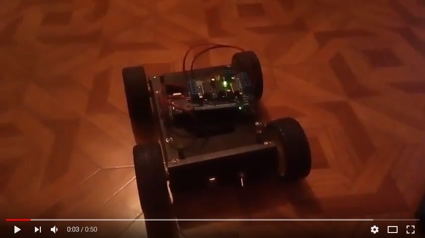

# WiFiRobot

Небольшой проект для дистанционного управления роботом/машинкой на основе платы Arduino Mega 2560 + WiFi (от RobotDyn)

## Содержимое

Репозиторий включает в себя следующие проекты:
* Прошивка для Arduino
* Прошивка для ESP266 (отсутствует, т.к. потерял исходники)
* Desktop-приложение для управления роботом

## Демонстрация

